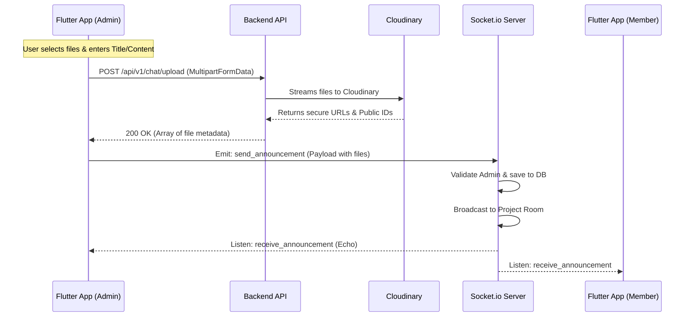

# Flutter Integration Guide: Project Announcements Feature

This guide provides full technical details for implementing the **Project Announcements** feature in the Flutter mobile application, matching the system design implemented in the Node.js backend and React web client.

---

## 1. Feature Architecture Overview

The Announcements feature uses a hybrid approach:
1. **REST API (`POST`)**: For uploading files (images, documents, PDFs, etc.) to the server, which uploads them to Cloudinary and returns URLs.
2. **Socket.io (`WebSocket`)**: For real-time delivery and broadcasting of announcements.
3. **REST API (`GET`)**: For retrieving historic announcements when entering the room.



---

## 2. API Endpoints

### A. Upload Files
* **Endpoint**: `POST /api/v1/chat/upload`
* **Headers**:
  * `Authorization: Bearer <JWT_TOKEN>`
  * `Content-Type: multipart/form-data`
* **Request Body (Multipart)**:
  * Field Name: `files` (Array of files)
* **Response (200 OK)**:
  ```json
  {
    "data": [
      {
        "url": "https://res.cloudinary.com/.../file.png",
        "public_id": "uploads/images/xyz123"
      }
    ]
  }
  ```

#### Flutter Implementation (using `Dio`):
```dart
import 'package:dio/dio.dart';

Future<List<Map<String, String>>> uploadAnnouncementFiles(List<String> filePaths, String token) async {
  final dio = Dio();
  final formData = FormData();

  for (String path in filePaths) {
    formData.files.add(MapEntry(
      'files',
      await MultipartFile.fromFile(path),
    ));
  }

  try {
    final response = await dio.post(
      'https://<YOUR_API_BASE_URL>/api/v1/chat/upload',
      data: formData,
      options: Options(
        headers: {
          'Authorization': 'Bearer $token',
        },
      ),
    );

    if (response.statusCode == 200) {
      final List data = response.data['data'];
      return data.map((item) => {
        'url': item['url'] as String,
        'public_id': item['public_id'] as String,
      }).toList();
    } else {
      throw Exception("Upload failed");
    }
  } catch (e) {
    rethrow;
  }
}
```

### B. Fetch Announcement History
* **Endpoint**: `GET /api/v1/chat/announcements/:projectId`
* **Headers**: `Authorization: Bearer <JWT_TOKEN>`
* **Response (200 OK)**:
  ```json
  {
    "data": [
      {
        "_id": "651a2b...",
        "type": "announcement",
        "sender": "john_doe",
        "projectId": "65191a...",
        "title": "System Update",
        "content": "Description of the update...",
        "files": [
          {
            "url": "https://...",
            "public_id": "..."
          }
        ],
        "readBy": ["john_doe"],
        "createdAt": "2026-07-07T06:04:55.000Z"
      }
    ]
  }
  ```

---

## 3. Real-Time Socket.io Events

Your Flutter client should be using the `socket_io_client` package.

### A. Room Subscription
Before sending or receiving announcements, the client must join the project's room.
* **Socket Event**: `join_project`
* **Payload**: `projectId` (String)

```dart
socket.emit('join_project', projectId);
```

### B. Sending an Announcement (Admin Only)
* **Socket Event**: `send_announcement`
* **Validation Rules**:
  * `title` is **required** (String, Max 200 chars).
  * `content` is **optional** (String, Max 2000 chars).
  * `files` are **optional** (Array of File objects).
* **Payload Structure**:
  ```json
  {
    "projectId": "PROJECT_ID_STRING",
    "title": "Announcement Title",
    "content": "Announcement text description",
    "files": [
      { "url": "https://...", "public_id": "..." }
    ]
  }
  ```

```dart
void publishAnnouncement(String projectId, String title, String content, List<Map<String, String>> uploadedFiles) {
  socket.emit('send_announcement', {
    'projectId': projectId,
    'title': title,
    'content': content,
    'files': uploadedFiles,
  });
}
```

### C. Receiving Announcements
All clients connected in the project room (both admin and members) must listen for the broadcast event.
* **Socket Event**: `receive_announcement`
* **Incoming Payload**: Same structure as the DB entity (returns `_id`, `sender`, `createdAt`, etc.)

```dart
socket.on('receive_announcement', (data) {
  // Update state
  handleIncomingAnnouncement(data);
});
```

---

## 4. State & UI Integrity Constraints (Crucial)

### A. State Collision Prevention (Group Chat vs. Announcements)
**IMPORTANT**: In the database, both Group Messages and Announcements reference the same `projectId`. If you store chat history in a local map keyed only by the `projectId` (e.g. `messages[projectId]`), **they will collide**, and switching between Group Chats and Announcements will scramble the history.

**Solution**: Key your state by combining the message type and project ID:
```dart
// Dart State structure
Map<String, List<Message>> localMessages = {};

// Key generation
String groupKey = "group:$projectId";
String announcementKey = "announcement:$projectId";
```
When fetching history or receiving socket payloads:
* Save group messages under `group:$projectId`.
* Save announcements under `announcement:$projectId` (use `payload['type']` to determine the key).

### B. Admin-Only Posting UI
* In the project model, locate the field `usernameAdmin`.
* Compare this with the logged-in user's `username`.
* **If they match (Admin)**: Show a prominent **"Create Announcement"** button at the bottom of the Screen. Clicking this button should open a fullscreen/bottom-sheet modal with fields for Title, Content, and Attachments.
* **If they do NOT match (Member)**: **Do not render any text input or post buttons**. The UI should simply be read-only scrolling cards.

### C. Text Wrapping and Layout Integrity
To prevent long text titles or descriptions from breaking your layout:
1. **Title**: Wrap inside a `Text` widget with `overflow: TextOverflow.ellipsis` or `maxLines: 1` if you want a clean list look. Or use `Flexible` within a Row.
2. **Content Description**: Wrap text inside a `SelectableText` or a `Text` widget with a wrapping layout (e.g. `Flexible`, `Expanded`, or inside a `Column` with `crossAxisAlignment: CrossAxisAlignment.start`). Enable selection for copy-pasting.
3. **Attachments**: Display attachment chips using a `Wrap` widget to dynamically arrange attachments horizontally/vertically without overflowing.

#### Example Flutter Card Structure:
```dart
Widget buildAnnouncementCard(Map<String, dynamic> msg) {
  return Card(
    margin: EdgeInsets.all(8),
    child: Padding(
      padding: EdgeInsets.all(12),
      child: Column(
        crossAxisAlignment: CrossAxisAlignment.start,
        children: [
          Row(
            mainAxisAlignment: MainAxisAlignment.between,
            children: [
              Expanded(
                child: Text(
                  msg['title'] ?? 'Announcement',
                  style: TextStyle(fontWeight: FontWeight.bold, fontSize: 16),
                  overflow: TextOverflow.ellipsis,
                ),
              ),
              Text(
                formatTime(msg['createdAt']),
                style: TextStyle(fontSize: 10, color: Colors.grey),
              ),
            ],
          ),
          if (msg['content'] != null && msg['content'].isNotEmpty) ...[
            SizedBox(height: 8),
            Text(
              msg['content'],
              style: TextStyle(fontSize: 14),
            ),
          ],
          if (msg['files'] != null && (msg['files'] as List).isNotEmpty) ...[
            SizedBox(height: 12),
            Wrap(
              spacing: 8.0,
              runSpacing: 4.0,
              children: (msg['files'] as List).map<Widget>((file) {
                return ActionChip(
                  avatar: Icon(Icons.attach_file, size: 14),
                  label: Text('Attachment'),
                  onPressed: () => openAttachmentUrl(file['url']),
                );
              }).toList(),
            ),
          ],
          SizedBox(height: 8),
          Text(
            '— ${msg['sender']}',
            style: TextStyle(fontSize: 11, fontStyle: FontStyle.italic, color: Colors.grey),
          ),
        ],
      ),
    ),
  );
}
```
